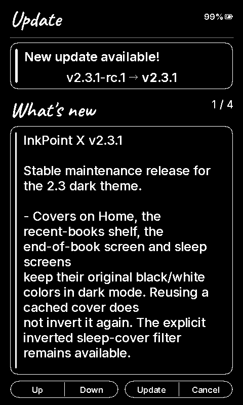

# v2.3.1 acceptance checks

Connected hardware: XTEINK X4, ESP32-C3. Tests performed on 2026-09-19.

- 184 host tests passed, including repeated dark refreshes with automatic cleanup
  disabled and returning to the light theme.
- All 28 locales and 12 UI fonts passed localization validation.
- Local production and compact USB diagnostic builds fit the 0x640000-byte OTA slot.
- Saved and verified the installed v2.3.0 app partition before USB testing.
- Compared the same real book cover on Home in light and dark themes: every pixel
  in the 349 × 522-pixel interior matched. The surrounding interface inverted.
- Repeated Home redraws from the in-memory cover cache matched the full prior
  framebuffer byte for byte. Library navigation and EPUB page turns completed.
- Dark frames completed the full waveform in approximately 3729 ms, versus the
  previous 503 ms differential update. Dark output also requests panel power-off.

Private book screenshots and flash backups remain local. Framebuffer captures prove
image polarity and layout, not the panel's physical ghosting or its optical density.
The full waveform and power-off address both accumulated residue and idle fading;
remaining physical artifacts need direct observation on the panel.

## Published firmware

GitHub Actions [35443141181](https://github.com/yokki-vans/InkPointX/actions/runs/35443141181)
passed all release gates. The latest release is stable (neither draft nor prerelease).

- App descriptor: `v2.3.1` (no RC suffix).
- Size: 6,533,792 bytes; OTA slot: 6,553,600 bytes.
- SHA-256: `15f247c4ca92f720e47411aab7a4b6dce00eb61c930ee5e44399176591a16db8`.
- All five firmware aliases share this checksum.
- The connected X4 discovered the published release over TLS 1.3:

## Installed via OTA

The X4 downloaded the published firmware over Wi-Fi, installed it and rebooted.
OTA metadata selected app0 (`0x10000`), sequence 19, state `VALID` (2): the firmware
passed its storage/display/first-frame health gate. `esptool verify_flash` matched
all 6,533,792 bytes against the downloaded release image. The device was reset
back into this production build after verification.
