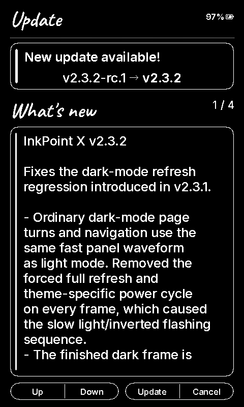

# v2.3.2 dark-mode speed verification

Connected XTEINK X4, 2026-09-19. This fixes the v2.3.1 regression: forcing FULL on
all dark frames made every interaction take about 3.7 seconds and visibly cycle
through light/inverted phases. v2.3.2 uses the caller's normal refresh cadence and
power setting in both themes. Pixel inversion happens in RAM before submission.

## Measured on the same device

Eight alternating Down/Up actions in Screen & Power, with identical settings and
no screenshot transfers during the measurements:

| Theme | Panel refresh range | Median | Submissions / completed refreshes |
| --- | --- | --- | --- |
| Light | 503–504 ms | 504 ms | 8 / 8 |
| Dark | 503–504 ms | 503 ms | 8 / 8 |

Each action submitted one FAST frame (`mode=2`) and completed one refresh. No FULL
or HALF was requested during either navigation sequence. These are controller
BUSY-wait timings, not a camera recording or a measurement of total layout time.
The test profile enables SDK display tracing; production does not include it.

EPUB forward/back checks likewise used 503–504 ms FAST updates. Initial entry and
the existing periodic reader cleanup used HALF (1716 ms), following the user's
configured cadence. Theme switching still performed its single intentional clean.

The cover interior matched the prior light-theme image pixel for pixel. Cached
and fresh cover redraws also matched; their only full-screen difference was the
battery percentage in the header. Private book captures remain local.

[Measured samples](refresh-comparison.json). The device owner also confirmed that
page turns now look normal and fast, without the previous slow light-screen cycle.

## Build checks

- 184 host tests passed, including a one-time theme refresh followed by 64 FAST
  frames and preservation of the reader's cleanup cadence.
- 28 locales and 12 generated UI fonts validated.
- Static analysis: no high or medium findings (41 low-level findings).
- Production image: 6,533,744 bytes locally, below the 6,553,600-byte OTA slot.
- The installed v2.3.1 image was verified before loading the diagnostic build.

## Stable release

GitHub Actions [35444806603](https://github.com/yokki-vans/InkPointX/actions/runs/35444806603)
passed all release checks. The published app descriptor is `v2.3.2`, without an RC
suffix. It is the latest stable release, neither a draft nor a prerelease.

- Published image size: 6,533,776 bytes.
- SHA-256: `370167d73b32ce02d7376832387f2396bd58500b6506b6161c56ea01bcca6bde`.
- All five firmware aliases have the same checksum.
- The connected X4 discovered the stable release through its OTA screen:

## Installed on X4 via OTA

The X4 downloaded the stable release over Wi-Fi, installed it and rebooted. OTA
metadata selected app1 (`0x650000`), sequence 20, state `VALID` (2), confirming the
firmware's storage/display/first-frame health gate. `esptool verify_flash` matched
all 6,533,776 bytes against the published image. The device was then reset back
into this production build.
