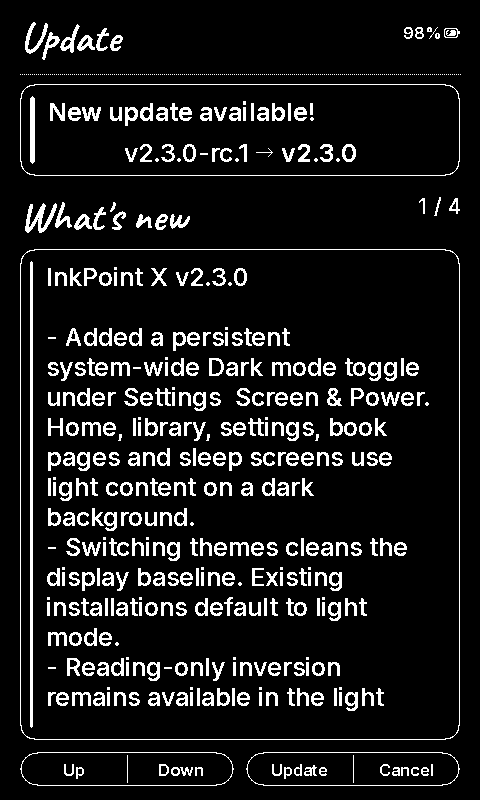

# InkPoint X 2.3 — X4 acceptance checks

Date: 2026-09-19. Hardware: connected XTEINK X4, ESP32-C3.
Base: v2.2.28 (`3924bde`) with SDK `37542a0`.

## Automated checks

- Host suite: **182/182 passed**.
- Localization: **28 locales, 618 strings, 12 UI fonts**; coverage passed.
- Static analysis: default and device QA configurations pass the medium-severity gate.
- Formatting and whitespace checks pass for changed C/C++ files.
- Local production build: **6,532,928 bytes**. Published CI build: **6,532,960 bytes**.
  Both fit the **6,553,600-byte** OTA slot.
- Compact USB test build: **6,537,392 bytes**, also within the slot.

## Device checks

- Flashed the compact diagnostic build to the existing app partition, with write verification.
- Enabled Dark mode using the real Screen & Power settings toggle over synthetic button input.
- Captured and inspected both settings screens below.
- Restarted the device and confirmed the saved dark theme on the home screen.
- Opened the library in dark mode and checked list selection and navigation labels.
- Switched themes six consecutive times: free heap stayed at **127,920 bytes**,
  with a **114,676-byte** largest free allocation after each measured pair.
- Reached GitHub from the device using TLS 1.3 and completed the update check.
- Opened an existing EPUB and inspected white text on a black background.
- Enabled reading-only inversion alongside dark mode: the captured EPUB framebuffer
  remained byte-identical, confirming there is no double inversion.
- Restored reading inversion to Off and switched to light mode: every byte of the
  EPUB framebuffer became the exact complement of the dark capture; the grayscale
  refresh pass ran again. Reading position was preserved.

The captures come from the device framebuffer after applying the SDK's display polarity.
They verify UI content and layout; they do not measure the physical panel's ghosting or contrast.
X3 was covered by compilation and existing controller tests, not a connected-device run.

| Light | Dark |
| --- | --- |
|  |  |

The full pre-test flash backup and device logs are retained locally and are not release assets.

## Published release

[GitHub Actions run](https://github.com/yokki-vans/InkPointX/actions/runs/35441149108): **passed**.
[Release v2.3.0](https://github.com/yokki-vans/InkPointX/releases/tag/v2.3.0) is the latest stable release.

Published `firmware.bin` SHA-256:

```text
6047bcc4ba3c0d911ccef8cba49721398519c10a7341ca6c02cec0ed33e6b28e
```

Verified against GitHub's asset digest and `SHA256SUMS`; all five binary aliases
share this digest.

The on-device updater detected the published **v2.3.0** as an upgrade from the
compact **v2.3.0-rc.1** test build, over GitHub HTTPS.



## End-to-end OTA installation

- Confirmed the upgrade through the on-device updater using synthetic Confirm input.
- The X4 downloaded the public GitHub release over Wi-Fi, installed it and restarted.
- Read back OTA metadata after boot: sequence **18**, slot **app1**, state
  **ESP_OTA_IMG_VALID (2)**. The previous slot remained valid at sequence 17.
- Ran esptool `verify_flash` against the downloaded public `firmware.bin` at
  **0x650000**: **digest matched**, across all **6,532,960 bytes**.
- The device was left running the published production firmware, with dark mode enabled
  and reading-only inversion restored to its original Off setting.
