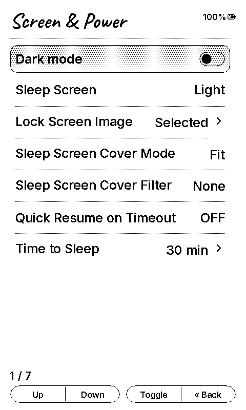
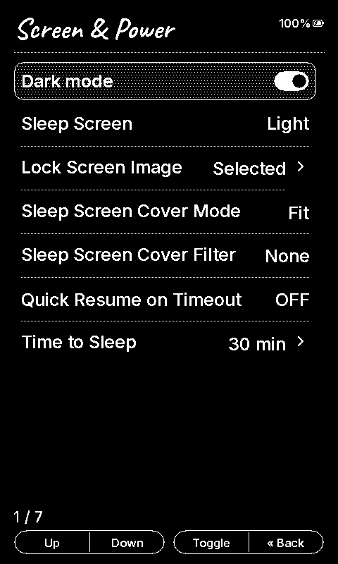

# InkPoint X 2.3 — X4 acceptance checks

Date: 2026-09-19. Hardware: connected XTEINK X4, ESP32-C3.
Base: v2.2.28 (`3924bde`) with SDK `37542a0`.

## Automated checks

- Host suite: **182/182 passed**.
- Localization: **28 locales, 618 strings, 12 UI fonts**; coverage passed.
- Static analysis: default and device QA configurations pass the medium-severity gate.
- Formatting and whitespace checks pass for changed C/C++ files.
- Production build: **6,532,928 bytes**, below the **6,553,600-byte** OTA slot.
- Compact USB test build: **6,537,392 bytes**, also within the slot.

## Device checks

- Flashed the compact diagnostic build to the existing app partition, with write verification.
- Enabled Dark mode using the real Screen & Power settings toggle over synthetic button input.
- Captured and inspected both settings screens below.
- Restarted the device and confirmed the saved dark theme on the home screen.
- Opened an existing EPUB and inspected white text on a black background.
- Enabled reading-only inversion alongside dark mode: the captured EPUB framebuffer
  remained byte-identical, confirming there is no double inversion.
- Restored reading inversion to Off and switched to light mode: every byte of the
  EPUB framebuffer became the exact complement of the dark capture; the grayscale
  refresh pass ran again. Reading position was preserved.

The captures come from the device framebuffer after applying the SDK's display polarity.
They verify UI content and layout; they do not measure the physical panel's ghosting or contrast.
X3 was covered by compilation and existing controller tests, not a connected-device run.

| Light | Dark |
| --- | --- |
|  |  |

The full pre-test flash backup and device logs are retained locally and are not release assets.
